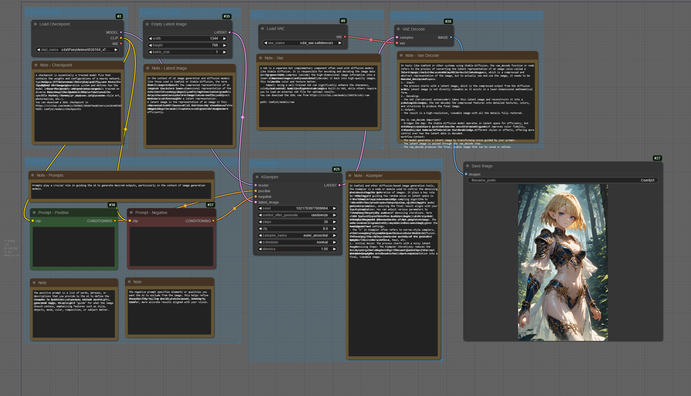

# Basic Workflow for SDXL

## Download

| File            | Download                               |
| --------------- | -------------------------------------- |
| Workflow - JSON | [Download](./SDXL_Basic_Workflow.json) |
| Workflow - PNG  | [Download](./SDXL_Basic_Workflow.png)  |

## Image Preview (holds the metadata)

## Information

### Workflow Quick Summary

1. Model Setup:
   - Load the SDXL checkpoint and VAE.
   - Initialize an empty latent image.
2. Text Guidance:
   - Define positive and negative prompts to control the image generation process.
3. Sampling:
   - Use the KSampler to iteratively refine the latent image, guided by the prompts and model.
4. Decoding:
   - Decode the refined latent image into a high-quality visual output using the VAE.
5. Save Output:
   - Export the final image for use or sharing.

This workflow provides a basic but powerful structure for generating images with precise control over style, content, and quality.

### Workflow Full Summary

1. **Checkpoint loader**

   - Node: CheckpointLoaderSimple
   - Purpose: Loads the pre-trained Stable Diffusion XL (SDXL) checkpoint model (30104_v70.safetensors).
   - Role: Acts as the "brain" for image generation, defining the style and capability of the model.

2. **Vae Loader**

   - Node: VAELoader
   - Purpose: Loads the Variational Autoencoder (sdxl_vae.safetensors).
   - Role: Enhances the visual quality of the generated image by encoding and decoding latent representations.

3. **Latent Image**

   - Node: EmptyLatentImage
   - Purpose: Creates an empty latent image space with dimensions of 1344x768 and a batch size of 1.
   - Role: Serves as the starting point for the latent representation of the image.

4. **Prompts (Text Encoding)**

   - Nodes:
     - Positive Prompt (CLIPTextEncode): Encodes the text input to guide the AI toward desired elements in the image.
     - Negative Prompt (CLIPTextEncode): Encodes text to specify what the AI should exclude from the image.
   - Role: Defines the artistic or thematic features (positive) and excludes unwanted artifacts or elements (negative).

5. **KSampler**

   - Node: KSampler
   - Purpose: Performs the core denoising process using the selected sampling algorithm (euler_ancestral).
   - Parameters:
     - Sampling Steps: The number of denoising iterations. More steps typically yield better-quality images (up to a point) but take longer to process.
     - CFG Scale: Controls how strongly the model adheres to the prompt. Higher values enforce more alignment but can also reduce creativity or realism.
     - Seed: Determines the randomness of the generated image. The same seed will consistently reproduce the same image given the same prompt and settings.
   - Role: Converts the noisy latent image into a structured latent representation based on the prompt and model.

6. **VAE Decode**

   - Node: VAEDecode
   - Purpose: Decodes the processed latent image into a full-resolution, viewable pixel-space image.
   - Role: Bridges the gap between latent space and the final image, adding textures, colors, and details.

7. **Save Image**
   - Node: SaveImage
   - Purpose: Outputs and saves the final image.
   - Output Name: ComfyUI.
