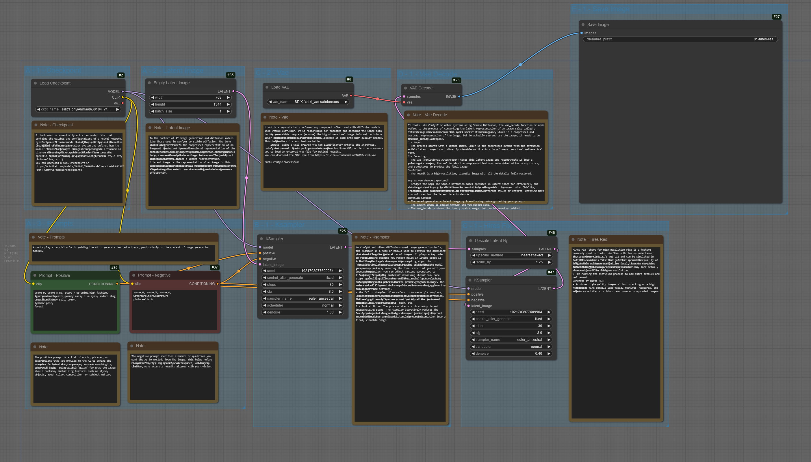
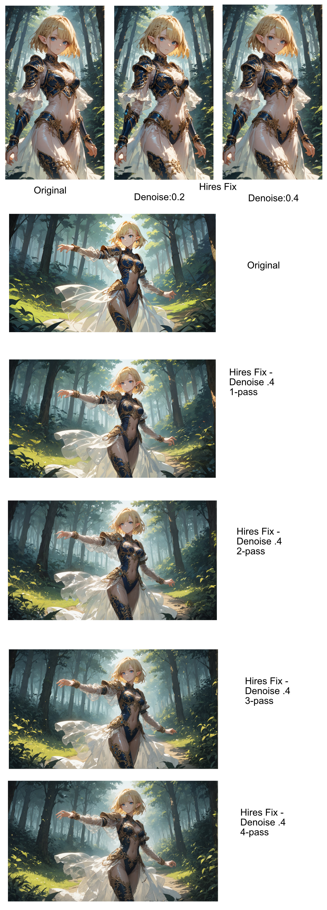

# Basic Workflow for SDXL

## Download

| File                      | Download                                       |
| ------------------------- | ---------------------------------------------- |
| Workflow - JSON           | [Download](./2._SDXL_Hires_Fix.json)           |
| Workflow Multipass - JSON | [Download](./2._SDXL_Hires_Fix_multipass.json) |
| Workflow - PNG            | [Download](./2._SDXL_Hires_Fix.png)            |
| Workflow Multipass - PNG  | [Download](./2._SDXL_Hires_Fix_multipass.png)  |

## Image Preview (holds the metadata)

## Information

### Purpose of the workflow

This workflow focuses on generating high-quality, upscaled images using SDXL with the Hires Fix technique. It balances computational efficiency by starting with a low-resolution latent image and refining it through upscaling and additional diffusion passes.

### Workflow Overview

1. Load Checkpoint and VAE.
2. Initialize a latent space and apply text prompts (positive/negative).
3. Perform an initial denoising pass with KSampler.
4. Apply Hires Fix: upscale and refine the latent image.
5. Decode the refined latent representation into a high-resolution image.
6. Save the final image.

### Workflow Full Summary

A. **Inputs**

1. **Checkpoint loader**

   - Node: CheckpointLoaderSimple
   - Purpose: Loads the pre-trained Stable Diffusion XL (SDXL) checkpoint model (30104_v70.safetensors).
   - Role: Acts as the "brain" for image generation, defining the style and capability of the model.

2. **Latent Image**

   - Node: EmptyLatentImage
   - Purpose: Creates an empty latent image space with dimensions of 1344x768 and a batch size of 1.
   - Role: Serves as the starting point for the latent representation of the image.

3. **Prompts (Text Encoding)**

   - Nodes:
     - Positive Prompt (CLIPTextEncode): Encodes the text input to guide the AI toward desired elements in the image.
     - Negative Prompt (CLIPTextEncode): Encodes text to specify what the AI should exclude from the image.
   - Role: Defines the artistic or thematic features (positive) and excludes unwanted artifacts or elements (negative).

B. **KSampler**

1.  **KSampler (Initial Pass)**

    - Node: KSampler
    - Purpose: Performs the core denoising process using the selected sampling algorithm (euler_ancestral).
    - Parameters:
      - Sampling Steps: The number of denoising iterations. More steps typically yield better-quality images (up to a point) but take longer to process.
      - CFG Scale: Controls how strongly the model adheres to the prompt. Higher values enforce more alignment but can also reduce creativity or realism.
      - Seed: Determines the randomness of the generated image. The same seed will consistently reproduce the same image given the same prompt and settings.
    - Role: Generates the first version of the latent image based on prompts, model, and noise.

C. **Hires Fix and Vae**

1. **Hires Fix**

   - Nodes:
     - LatentUpsaleBy: Upscales the latent image by a factor of 1.25 using nearest-exact interpolation.
     - KSampler (Refinement Pass): Refines the upscaled latent image with adjusted settings
   - Purpose: Improves the quality of the generated image by:
     - Upscaling it to a higher resolution.
     - Re-running the sampling process to add finer details like sharp edges, textures, and clarity.
   - Role: Achieves high-resolution, detailed images without the need to start at high computational cost.

2. **Vae**

   - Node: VAELoader
   - Purpose: Loads the Variational Autoencoder (sdxl_vae.safetensors).
   - Role: The VAE helps decode the latent representation back into a viewable image with enhanced textures, colors, and structure.

D. **VAE Decode**

1. **VAE Decode**

   - Node: VAEDecode
   - Purpose: Decodes the processed latent image into a full-resolution, viewable pixel-space image.
   - Role: Bridges the gap between latent space and the final image, adding textures, colors, and details.

E. **Save Image**

1. **Save Image**
   - Node: SaveImage
   - Purpose: Outputs and saves the final image.
   - Output Name: ComfyUI.
